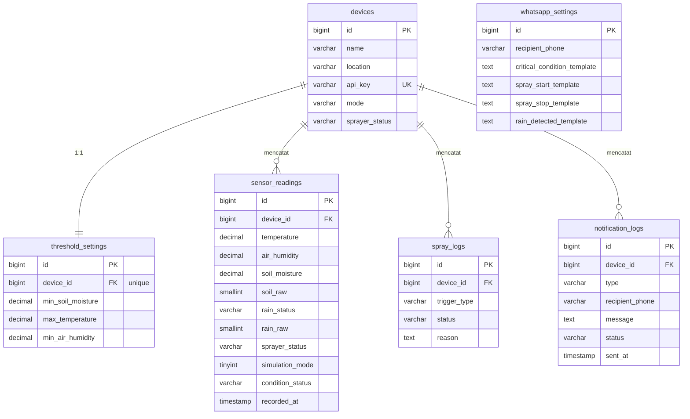

# Database Schema — Smart Sprayer IoT

> Ringkasan skema database. Fokus pada **tabel domain** yang dipakai aplikasi.  
> Halaman web **tanpa login**; autentikasi hanya via `devices.api_key` untuk API IoT.

---

## Daftar Tabel Domain

| # | Tabel | Fungsi | Migrasi |
|---|-------|--------|---------|
| 1 | `devices` | Perangkat ESP32, mode, status sprayer, `api_key` | `2026_05_24_000004_create_smart_sprayer_domain_tables.php` |
| 2 | `threshold_settings` | Batas suhu, kelembapan, tanah (1:1 device) | `2026_05_24_000004_create_smart_sprayer_domain_tables.php` |
| 3 | `sensor_readings` | Data sensor + `condition_status` | `2026_05_24_000004_...` + `2026_06_03_082039_add_actual_esp32_fields_to_sensor_readings_table.php` |
| 4 | `spray_logs` | Audit trail penyemprotan | `2026_05_24_000004_create_smart_sprayer_domain_tables.php` |
| 5 | `notification_logs` | Riwayat notifikasi WhatsApp | `2026_05_24_000004_create_smart_sprayer_domain_tables.php` |
| 6 | `whatsapp_settings` | Nomor penerima & template pesan | `2026_05_24_000005_create_whatsapp_settings_table.php` |

**Catatan:** Laravel juga membuat tabel sistem (`jobs` untuk queue WhatsApp, `cache`, dll.) — tidak didokumentasikan di sini karena bukan bagian domain bisnis.

---

## SQL DDL — Tabel Domain

```sql
-- devices
CREATE TABLE `devices` (
    `id`             BIGINT UNSIGNED AUTO_INCREMENT PRIMARY KEY,
    `name`           VARCHAR(255) NOT NULL,
    `location`       VARCHAR(255) NOT NULL,
    `api_key`        VARCHAR(255) NOT NULL UNIQUE,
    `mode`           VARCHAR(255) NOT NULL DEFAULT 'manual',
    `sprayer_status` VARCHAR(255) NOT NULL DEFAULT 'off',
    `created_at`     TIMESTAMP NULL,
    `updated_at`     TIMESTAMP NULL
);

-- threshold_settings (1:1 dengan devices)
CREATE TABLE `threshold_settings` (
    `id`                BIGINT UNSIGNED AUTO_INCREMENT PRIMARY KEY,
    `device_id`         BIGINT UNSIGNED NOT NULL UNIQUE,
    `min_soil_moisture` DECIMAL(5, 2) NOT NULL,
    `max_temperature`   DECIMAL(5, 2) NOT NULL,
    `min_air_humidity`  DECIMAL(5, 2) NOT NULL,
    `created_at`        TIMESTAMP NULL,
    `updated_at`        TIMESTAMP NULL,
    FOREIGN KEY (`device_id`) REFERENCES `devices` (`id`) ON DELETE CASCADE
);

-- sensor_readings (data dari ESP32 / simulator)
CREATE TABLE `sensor_readings` (
    `id`               BIGINT UNSIGNED AUTO_INCREMENT PRIMARY KEY,
    `device_id`        BIGINT UNSIGNED NOT NULL,
    `temperature`      DECIMAL(5, 2) NOT NULL,
    `air_humidity`     DECIMAL(5, 2) NOT NULL,
    `soil_moisture`    DECIMAL(5, 2) NOT NULL,
    `soil_raw`         SMALLINT UNSIGNED NULL,
    `rain_status`      VARCHAR(255) NOT NULL,
    `rain_raw`         SMALLINT UNSIGNED NULL,
    `sprayer_status`   VARCHAR(255) NOT NULL,
    `simulation_mode`  TINYINT(1) NOT NULL DEFAULT 0,
    `condition_status` VARCHAR(255) NOT NULL,
    `recorded_at`      TIMESTAMP NOT NULL,
    `created_at`       TIMESTAMP NULL,
    `updated_at`       TIMESTAMP NULL,
    INDEX (`device_id`, `recorded_at`),
    FOREIGN KEY (`device_id`) REFERENCES `devices` (`id`) ON DELETE CASCADE
);

-- spray_logs (audit trail)
CREATE TABLE `spray_logs` (
    `id`           BIGINT UNSIGNED AUTO_INCREMENT PRIMARY KEY,
    `device_id`    BIGINT UNSIGNED NOT NULL,
    `trigger_type` VARCHAR(255) NOT NULL,
    `status`       VARCHAR(255) NOT NULL,
    `reason`       TEXT NULL,
    `created_by`   BIGINT UNSIGNED NULL,
    `created_at`   TIMESTAMP NULL,
    `updated_at`   TIMESTAMP NULL,
    INDEX (`device_id`, `created_at`),
    FOREIGN KEY (`device_id`) REFERENCES `devices` (`id`) ON DELETE CASCADE
);

-- notification_logs (riwayat WhatsApp)
CREATE TABLE `notification_logs` (
    `id`              BIGINT UNSIGNED AUTO_INCREMENT PRIMARY KEY,
    `device_id`       BIGINT UNSIGNED NOT NULL,
    `type`            VARCHAR(255) NOT NULL,
    `recipient_phone` VARCHAR(20) NOT NULL,
    `message`         TEXT NOT NULL,
    `status`          VARCHAR(255) NOT NULL,
    `sent_at`         TIMESTAMP NULL,
    `created_at`      TIMESTAMP NULL,
    `updated_at`      TIMESTAMP NULL,
    INDEX (`device_id`, `sent_at`),
    FOREIGN KEY (`device_id`) REFERENCES `devices` (`id`) ON DELETE CASCADE
);

-- whatsapp_settings (konfigurasi global, tanpa FK)
CREATE TABLE `whatsapp_settings` (
    `id`                          BIGINT UNSIGNED AUTO_INCREMENT PRIMARY KEY,
    `recipient_phone`             VARCHAR(20) NULL,
    `critical_condition_template` TEXT NULL,
    `spray_start_template`        TEXT NULL,
    `spray_stop_template`         TEXT NULL,
    `rain_detected_template`      TEXT NULL,
    `created_at`                  TIMESTAMP NULL,
    `updated_at`                  TIMESTAMP NULL
);
```

---

## Diagram ER



---

## Relasi

```
devices ──1:1── threshold_settings
    │
    ├──1:N── sensor_readings
    ├──1:N── spray_logs
    └──1:N── notification_logs

whatsapp_settings  (standalone, tanpa FK)
```

---

## Nilai Enum Penting

| Kolom | Nilai |
|-------|-------|
| `devices.mode` | `manual`, `automatic` |
| `devices.sprayer_status` | `on`, `off` |
| `sensor_readings.rain_status` | `rain`, `no_rain` |
| `sensor_readings.condition_status` | `normal`, `waspada`, `kritis` |
| `spray_logs.trigger_type` | `manual`, `automatic` |
| `spray_logs.status` | `on`, `off` |
| `notification_logs.status` | `sent`, `failed` |

---

## Catatan Domain

1. **`devices.api_key`** — autentikasi ESP32/simulator ke `POST /api/sensor-readings`
2. **`threshold_settings`** — satu device punya satu konfigurasi threshold
3. **`sensor_readings`** — data immutable (riwayat saja, tidak diedit dari web)
4. **`spray_logs`** — wajib tercatat setiap perubahan status sprayer
5. **`whatsapp_settings`** — template pesan dikelola dari `/admin/whatsapp`
6. Index `(device_id, recorded_at)` pada `sensor_readings` untuk query time-series

Detail per kolom (format skripsi): lihat `database/spesifikasi-basis-data.md`.
