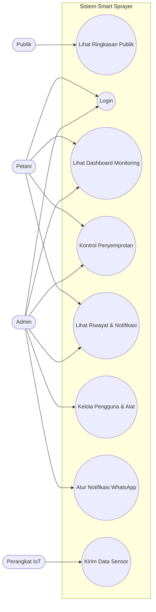
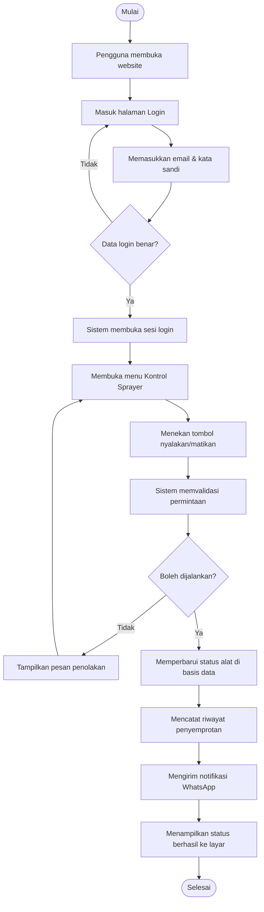
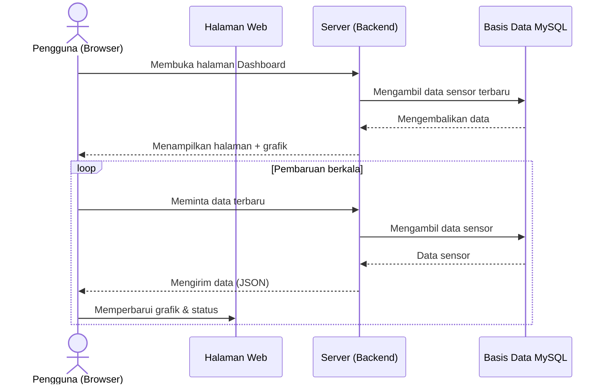
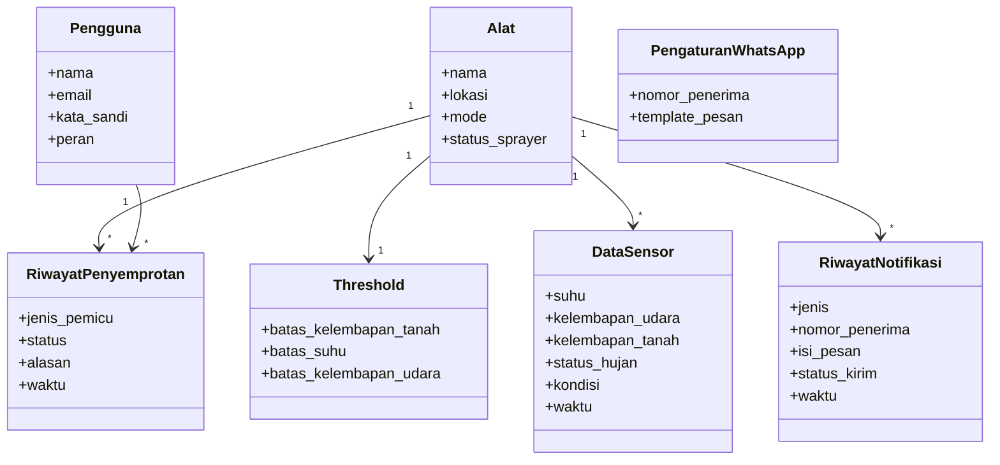

# Perancangan Sistem (UML)

Perancangan arsitektur perangkat lunak Smart Sprayer IoT dipetakan menggunakan
Unified Modelling Language (UML) untuk memvisualisasikan alur sistem berbasis web.
Diagram disusun pada tingkat gambaran umum agar mudah dibaca, namun tetap
mencerminkan alur dan struktur data sistem yang sebenarnya.

Aktor pada sistem ini terdiri dari **Publik** (melihat ringkasan tanpa login),
**Petani**, **Admin**, dan **Perangkat IoT** yang mengirimkan data sensor.

---

## 1. Use Case Diagram

Aktor utama yang berinteraksi langsung adalah Petani dan Admin setelah melakukan
login. Publik hanya dapat melihat halaman ringkasan, sedangkan Perangkat IoT
berperan sebagai sumber data sensor lingkungan.

---

## 2. Activity Diagram — Login & Kontrol Sprayer

Alur dimulai saat pengguna membuka website dan melakukan login. Setelah sistem
memvalidasi kredensial, pengguna dapat membuka menu Kontrol Sprayer, menekan
tombol aktivasi, lalu sistem memvalidasi permintaan, memperbarui status pada
basis data, mencatat riwayat, mengirim notifikasi, dan menampilkan status
berhasil ke layar.

---

## 3. Sequence Diagram — Dashboard Monitoring

Saat pengguna membuka halaman dashboard, server mengambil data sensor dari basis
data dan menampilkannya beserta grafik. Selanjutnya halaman memperbarui datanya
secara berkala dengan meminta data terbaru ke server. Grafik digambar oleh
library Chart.js, sedangkan Tailwind CSS digunakan untuk tampilan dan tata letak.

---

## 4. Class Diagram (struktur data utama)

Struktur data utama berpusat pada entitas Alat yang memiliki satu konfigurasi
Threshold serta banyak Data Sensor, Riwayat Penyemprotan, dan Riwayat Notifikasi.
Pengguna terhubung ke Riwayat Penyemprotan sebagai pihak yang melakukan kontrol
manual, dan Pengaturan WhatsApp menyimpan nomor penerima serta template pesan
notifikasi.
